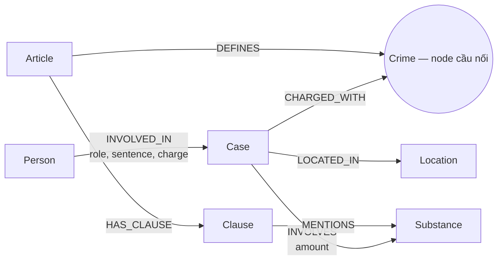

# Thiết kế Ontology — Day 19

**Họ tên:** Nguyễn Văn Đại
**MSSV:** 2A202602477

**Lựa chọn:**
- [x] Dùng ontology gợi ý (có chỉnh cách truy hồi theo câu hỏi)
- [ ] Tự thiết kế (xét bonus +15)

## 1. Sơ đồ

## 2. Entity types (node labels)

| Label | Ý nghĩa | Khóa định danh (`MERGE` theo) | Properties | KB | Trích bằng |
| --- | --- | --- | --- | --- | --- |
| `Article` | Điều luật | `id` | `title`, `law`, `doc_id` | luật | regex/front matter |
| `Clause` | Khoản trong điều luật | `id` | `number`, `penalty`, `text`, `doc_id` | luật | regex |
| `Crime` | Tội danh chuẩn, cầu nối hai KB | `name` | `name` | cả hai | regex (luật), LLM + chuẩn hóa (tin) |
| `Case` | Vụ việc được bài báo mô tả | `name` | `summary`, `date`, `doc_id`, `source_title` | tin | LLM |
| `Person` | Người liên quan vụ việc | `name` | `aliases` | tin | LLM |
| `Substance` | Chất ma túy chuẩn hóa | `name` | `name` | cả hai | danh sách chuẩn + đối sánh |
| `Location` | Địa điểm vụ việc | `name` | `name` | tin | LLM |

`Article`, `Clause` và `Case` mang `doc_id` vì được sinh trực tiếp từ một tài liệu. Các node dùng chung không gắn độc quyền với một tài liệu.

## 3. Relationships

| Type | Từ → Đến | Properties trên cạnh | Ý nghĩa |
| --- | --- | --- | --- |
| `DEFINES` | `Article` → `Crime` | — | Điều luật định nghĩa tội danh |
| `HAS_CLAUSE` | `Article` → `Clause` | — | Điều luật chứa khoản |
| `MENTIONS` | `Clause` → `Substance` | — | Khoản nhắc đến chất/ngưỡng liên quan |
| `CHARGED_WITH` | `Case` → `Crime` | — | Vụ việc liên quan tội danh |
| `INVOLVES` | `Case` → `Substance` | `amount` | Vụ việc có chất và khối lượng |
| `LOCATED_IN` | `Case` → `Location` | — | Địa điểm vụ việc |
| `INVOLVED_IN` | `Person` → `Case` | `role`, `sentence`, `charge` | Vai trò, tội danh và mức án của người trong vụ |

## 4. Node cầu nối giữa 2 KB

- **Node:** `Crime`.
- **Lý do:** luật nối `Article` với tội danh qua `DEFINES`, còn tin nối `Case` với cùng tội danh qua `CHARGED_WITH`; nhờ đó có đường đi `Case → Crime ← Article → Clause`.
- **Đảm bảo khớp tên:** `normalize_crime` chuyển chữ thường, bỏ khoảng trắng/thành phần “Tội”; `link_entity` ưu tiên khớp chính xác sau chuẩn hóa, sau đó fuzzy matching với ngưỡng 0,8 và luôn trả về tên chuẩn từ danh sách luật. Prompt trích xuất cũng buộc chọn từ danh sách tội danh luật.
- **Khi cầu gãy:** cách viết quá khác, bài báo không nêu tội danh, hoặc LLM trả sai cấu trúc. Hệ thống không nối bừa khi dưới ngưỡng; hướng xử lý là bổ sung bảng alias có kiểm duyệt, lưu mention chưa khớp để rà soát và validation kết quả trích xuất.

## 5. Competency questions

| Câu | Đường đi (Cypher pattern) | Trả lời được? |
| --- | --- | --- |
| Q1 | Vector chunk của Luật PCMT; graph không mô hình hóa khái niệm “tiền chất” | Có, nhờ phần vector của GraphRAG |
| Q2 | `(p:Person)-[r:INVOLVED_IN]->(k:Case)` với `r.sentence = 'tử hình'` | Có |
| Q3 | `(p:Person)-[r:INVOLVED_IN]->(k:Case)-[:CHARGED_WITH]->(c:Crime)<-[:DEFINES]-(a:Article)-[:HAS_CLAUSE]->(cl:Clause {number:1})` | Có |
| Q4 | `(p:Person)-[:INVOLVED_IN]->(k:Case)-[:CHARGED_WITH]->(c:Crime)<-[:DEFINES]-(a:Article)-[:HAS_CLAUSE]->(cl:Clause)`; chọn khung cao nhất | Có, nhưng chọn “tối đa” do LLM suy luận từ các khoản |
| Q5 | `(p:Person)-[:INVOLVED_IN]->(k:Case)-[i:INVOLVES]->(s:Substance)<-[:MENTIONS]-(cl:Clause)<-[:HAS_CLAUSE]-(a:Article)-[:DEFINES]->(c:Crime)<-[:CHARGED_WITH]-(k)` | Có; khối lượng nằm trên `INVOLVES`, ngưỡng nằm trong `Clause.text` |
| Q6 | `(s:Substance {name:'MDMA'})<-[:INVOLVES]-(k:Case)` rồi lấy `k.name`, `k.summary` | Có |

## 6. Quyết định thiết kế và đánh đổi

1. Chọn `Crime` làm node cầu nối thay vì nối thẳng bài báo với điều luật. Cách này tái sử dụng một tội danh cho nhiều vụ và cho phép traversal rõ nghĩa; đổi lại chất lượng phụ thuộc entity linking.
2. Chọn `Clause` là node riêng thay vì lưu toàn văn trong `Article`. Cách này truy hồi đúng khoản và khung hình phạt, nhưng làm graph lớn và vẫn cần đọc `text` để hiểu ngưỡng khối lượng.
3. Chọn mức án, vai trò và tội danh cá nhân làm property của `INVOLVED_IN`, không tạo node `Sentence`. Thiết kế gọn và giữ ngữ cảnh theo từng vụ; đổi lại khó chuẩn hóa/tổng hợp mọi loại bản án.
4. Dùng regex cho luật và LLM cho tin. Regex lặp lại ổn định trên văn bản có cấu trúc; LLM xử lý văn xuôi linh hoạt nhưng tốn chi phí và có thể bỏ sót hoặc sinh sai dữ kiện.

## 7. So với ontology gợi ý

Không áp dụng: bài dùng ontology gợi ý nên không yêu cầu xét bonus.

## 8. Hạn chế còn lại

Tên người và vụ án đang `MERGE` theo chuỗi chính xác nên có thể trùng thực thể khi báo viết khác tên. `Clause.text` chưa được tách thành các node/ngưỡng định lượng, vì vậy Q4–Q5 vẫn dựa vào LLM để so sánh khung và khối lượng. Một vụ xuất hiện trong nhiều bài cũng có nguy cơ tạo nhiều `Case` nếu tên do LLM đặt khác nhau.
